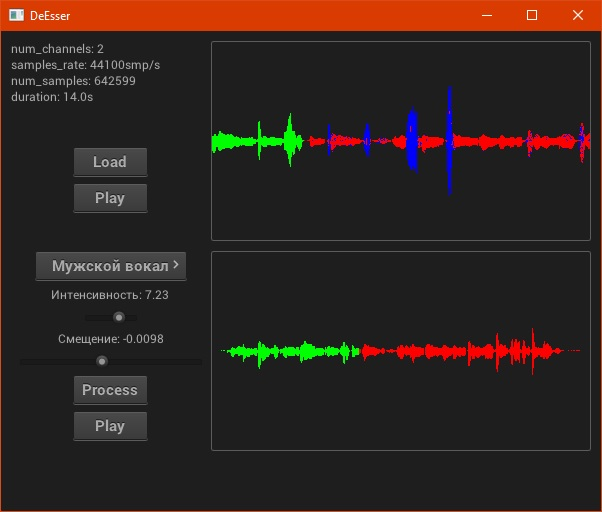

DeEsser
====================

Audio processing for getting rid of excessive prominence of sibilant consonants.



## Algorithm
Algorithm searches for excessive sibilants in audio by counting number of zero crossing in each area and
apply filter on areas, where counted number is greater than certain constant. Filter itself is converting
each area by Fast Fourier Transform, then suppress intensity of frequincies above certain threshold and
converting signal back by Inverse Fast Fouriers Transform.

## Build

```
git clone --recursive https://github.com/crataegus27/DeEsser.git
cd DeEsser
mkdir build
cd build 
cmake ..
make # your build command dependent on platform
```

## Dependencies

 - [nanogui](https://github.com/mitsuba-renderer/nanogui)
 - [libsoundio](https://github.com/andrewrk/libsoundio)
 - [fmt](https://github.com/fmtlib/fmt)
 - [stb_vorbis](http://nothings.org/stb_vorbis/)
 - [vorbis + ogg](https://github.com/Iunusov/OGG-Vorbis-CMAKE)

 ## Progress

 1. [X] Project initialization (cmake)
 2. [X] Loading and decoding ogg audio file from disk (stb_vorbis)
 3. [X] Streaming audio data to speakers through (libsoundio)
 4. [X] Rendering data like waveform, audio specs, playback control (nanogui)
 5. [X] Audio processing, fft -> suppress frequencies -> ifft
 6. [X] By average peeks finding
 7. [X] Interface to tune settings
 8. [X] Saving to ogg file (vorbis + ogg codec)
